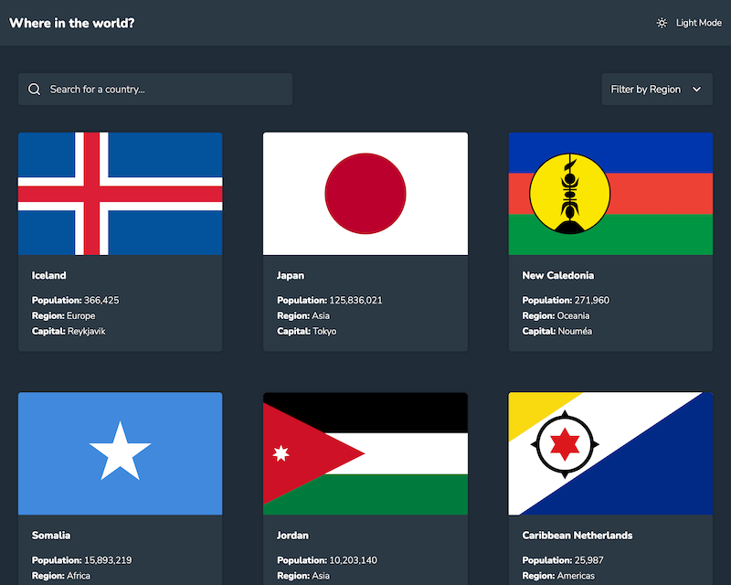

# Frontend Mentor - REST Countries API with color theme switcher

## Salut ! 👋

Merci de prendre le temps de voir ce projet.

C'est un challenge [Frontend Mentor](https://www.frontendmentor.io).

## [Voir en Live](https://olive-webdev.github.io/rest-countries-api-with-color-theme-switcher-master/)

## Le challenge

Il s'agissait d'intégrer une maquette et de consommer une API rest pour afficher une liste de pays.

L'utilisateur doit être capable:

- De voir tous les pays sur la page d'accueil
- De faire une recherche de pays
- De filtrer les pays par continent
- De cliquer sur un pays et être rediriger sur une autre page pour voir plus de détails
- De cliquer sur les pays frontaliers sur la page de détails
- De pouvoir choisir le mode sombre ou clair pour l'affichage de la page

## Choix techniques

Je suis en train d'apprendre ANGULAR, j'ai donc décidé de créer ce projet avec ce framework.

Premier projet avec ANGULAR, et... ANGULAR EST VRAIMENT GÉNIAL.♥️

## Apprentissage et Développement

J'ai découvert et appris:

* La CLI 
    * pour générer le projet, les composants, services, pipes
* Le routing
    * ce projet comporte deux routes, accueil et page de détail avec :id
* Les requètes HTTP
    * premières requêtes avec ANGULAR et initiation aux Observables
* NgOptimizedImage
    * en preview en janvier 2023, pour la gestion des images, le lazyLoading...
* InfiniteScrollModule
    * afin de ne pas charger un DOM avec 250 pays d'un coup!
* Les interfaces
    * J'ai bien sûr créer une interface pour les pays, pas évident quand l'API ne renvoie pas toujours exactement les mêmes clé dans les .json
* Les pipes
    * Pour la page de détail, l'API renvoie les pays frontaliers sous forme de code CCA3, J'ai créer une fonction afin de créer un objet avec pour clé le code CCA3 et en valeur le nom du pays et je m'en sert sur le template pour traduire le code CCA3 en nom de pays )
    * Pour le filtrage des pays(par continent ou par nom), j'avais d'abord opter pour un pipe appliqué à mon *ngFor pour ma liste de pays sur la page d'accueil, efficace, ça marchait, mais je me suis rendu compte à fil de mes lecture que ce n'était pas une bonne pratique et une manière moins performante de faire cela.(https://angular.io/guide/styleguide#do-not-add-filtering-and-sorting-logic-to-pipes). J'ai donc finalement mis ma logique dans mon composant.
* Les services
    * J'ai créer un service qui gère tous ce qui est requêtes HTTP
    * Et un autre pour l'UI, qui gère le light/dark mode

## Utilisation

Lorsqu'on arrive sur la page d'accueil,

- je vérifie d'abord s'il existe un thème préféré dans le localStorage.
- S'il y en a un, je l'utilise, sinon je questionne le navigateur pour connaitre les préférences de thème. Et j'applique mon thème en fonction. Ensuite si l'utilisateur veut changer de thème, il peut switché et ça sera enregistré dans le localStorage, pour des visites ultérieurs.

- Je requète l'API afin d'obtenir la liste de tous les pays. J'enregistre dans une variable que je fragmente (avec slice()) et qui push() à chaque scroll() afin de n'avoir qu'un minimum de pays charger au départ, et de ne pas surcharger le DOM et la mémoire.

- La recherche par nom de pays ce fait bien sûr sur tous les pays et non seulement ceux qui sont affichés au départ.
Le tri s'effectue instantanément en fonction des lettres tapées (include()). Aucune requète serveur n'est effectuée.
- Le filtrage par continent ceux fait aussi sur tous les pays reçus. Une fois un continent sélectionné, on peut en re-sélectionner un autre, ou bien supprimer le filtre. Aucune requète serveur n'est effectuée.
- Si un filtrage par pays est en cours, il est supprimé si on fait une recherche par nom et inversement le champ de recherche est effacé si on fait un tri par continent.
- Lorsqu'on clique sur la fiche d'un pays, on est redirigé vers la page de détails dudit pays. La requète serveur est indispensable car fournit en plus les pays frontaliers qui ne sont pas fournit dans la liste de tous les pays.
Les pays frontaliers (reçus en code CCA3 par l'API sont traduit en nom de pays) sont cliquables et permet d'aller sur la page de détail du pays cliqué.
- Le bouton retour tient compte de l'historique et permet de faire retour sur tous les pays cliqués et non de renvoyer simplement vers la page racine.

## À faire

- J'avais commencé à vouloir traduire la page en français, j'ai mis la locale fr, commencé à faire des pipes pour traduire certains textes, mais je me suis rendu compte qu'ANGULAR avait déjà la traduction i18n que l'on pouvait intégrer, mais ça m'aurait demandé encore plus de temps et le challenge était accompli. Mais j'ai commencé à regarder l'i18n d'angular et ça a l'air génial aussi, j'ai hâte de m'en servir.
- Le bouton de filtrage n'est pas ok niveau accessibilité, et onblur de replit pas le dropdown. J'aurai pu utilisé un composant ANGULAR/material.(à apprendre...j'ai testé un peu, il aurait fallu styliser...)
